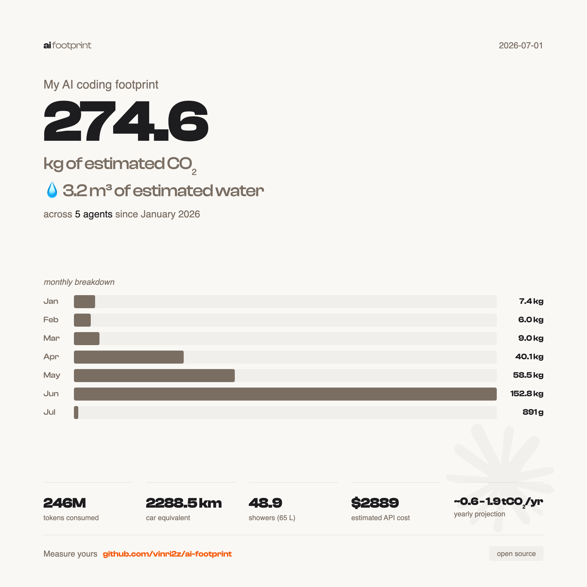

# ai-footprint

[](LICENSE)
[](https://github.com/vinri2z/ai-footprint/releases)

Track the carbon **and water** footprint of **all your AI coding agents** — Claude Code, Codex, Cursor, Gemini CLI, Copilot, OpenCode, and 30+ more — in one place.

Token usage is collected across every agent via [tokscale](https://github.com/junhoyeo/tokscale); the same peer-reviewed methodology then turns it into CO2 and water estimates, broken down by agent and provider.

**1. Install (or update):**

```bash
curl -fsSL https://raw.githubusercontent.com/vinri2z/ai-footprint/main/install.sh | bash
```

Same command to install and to update to the latest version.

**2. Restart Claude Code.** Your CO2 and water appear in the status line:

```
ai-footprint ⌥ main | 🟢 Opus 4.7 ▓▓▓░░░░░░░ 35% | 🪵 65g CO₂ · 💦 800mL · $0.50 | Use 24% ↻13:00
```

Segments, left to right: project + git branch, model + context window %, CO2 + water + session cost, 5h block usage % + reset time. A 🔥 prefix appears when the sustained burn rate would overshoot 100% of the limit by the end of the 5h block (after a 15 min grace window, only once usage reaches 15%).

The CO2 and water emoji cycle through a short loop on every status-line refresh — CO2 runs 🌳 → 🪵 → 🔥 → 💨 and water runs 🧊 → 💦 → 💧 → 💨. The frame index is derived from the wall clock (`epoch_seconds % 4`), so it advances one step per second regardless of the refresh cadence; Claude Code refreshes the status line frequently while active, so it reads as an animation.

On a narrow terminal the segments wrap onto additional rows (no truncation, no ellipsis) — e.g. at ~60 columns:

```
ai-footprint ⌥ main
🟢 Opus 4.7 ▓▓▓░░░░░░░ 35% | 🪵 65g CO₂ · 💦 800mL · $0.50
Use 24% ↻13:00
```

Wrapping uses the `$COLUMNS` width Claude Code provides (requires Claude Code v2.1.153+); on older versions it falls back to the single-line form.

**5h quota source.** The percentage comes directly from Anthropic's `/api/oauth/usage` endpoint (the same data Claude Code displays in `/usage`). No heuristic, no token-limit file to seed. Two sources in order:

1. **stdin** (preferred): if Claude Code injects `rate_limits.five_hour.used_percentage` in the statusline JSON, that value is used straight away.
2. **OAuth API fallback**: `GET https://api.anthropic.com/api/oauth/usage` with the bearer token from macOS Keychain, `CLAUDE_CODE_OAUTH_TOKEN`, or `~/.claude/.credentials.json`. Cached 60s in `~/.claude/ai-footprint/oauth-usage.json`.

Accurate on every plan, including Max 20x.

**3. Use the slash commands:**

- `/footprint-report` - interactive web dashboard with totals, equivalences, by-agent/provider/model breakdowns and a daily timeline
- `/footprint-card` - generate shareable PNG report cards (requires `playwright-core`, see [Dependencies](#dependencies))

## What it does

- Reads token usage across **all** local AI coding agents from [tokscale](https://github.com/junhoyeo/tokscale), caching computed results in a local SQLite DB so only live/new buckets are re-queried
- Estimates CO2 + water for every model — Anthropic and non-Anthropic alike — and breaks the footprint down by agent and provider
- Adds a live CO2 + water estimate for the in-flight Claude Code session to the status line, alongside session cost
- Two slash commands: `/footprint-report` (text) and `/footprint-card` (PNG)

## Example report

<p align="center">
  
</p>

Generate yours with `/footprint-card` in Claude Code. Exports summary and detailed PNGs to `exports/`.

<details>
<summary>Advanced options (CLI)</summary>

```bash
# Since a specific date
bash ~/code/ai-footprint/scripts/generate-report.sh --since 2026-03-01

# All time
bash ~/code/ai-footprint/scripts/generate-report.sh --all
```

</details>

<details>
<summary>Custom install directory</summary>

```bash
AI_FOOTPRINT_DIR=~/my-path/ai-footprint bash -c 'curl -fsSL https://raw.githubusercontent.com/vinri2z/ai-footprint/main/install.sh | bash'
```

</details>

<details>
<summary>Manual install</summary>

```bash
git clone https://github.com/vinri2z/ai-footprint.git ~/code/ai-footprint
bash ~/code/ai-footprint/scripts/setup.sh
```

Then add to `~/.claude/settings.json`:

```json
{
  "statusLine": {
    "type": "command",
    "command": "~/code/ai-footprint/scripts/statusline.sh"
  }
}
```

No background hooks are needed — reports read from tokscale on demand. Restart Claude Code.

</details>

## How it works

**One data source, plus a live display:**

| Script               | Trigger              | Data source                | Coverage         | Role                         |
| -------------------- | -------------------- | -------------------------- | ---------------- | ---------------------------- |
| `footprint-data.sh`  | Every report run     | tokscale (`models --json`) | All 30+ agents   | Single source for reports    |
| `statusline.sh`      | Every turn (live)    | `context_window` JSON      | Claude Code only | Live display (not persisted) |

**footprint-data** runs [tokscale](https://github.com/junhoyeo/tokscale) directly when a report is requested (`tokscale models --json --group-by client,provider,model --since … --until …`), which reads each agent's native session store and reports per-`(client, provider, model)` token counts (and handles dedup/attribution itself). Each model is mapped to a family, CO2 + water are computed with the per-model factors, and an aggregated JSON document is emitted for the report consumers. tokscale's `models` report can't group by date, so the daily timeline and monthly chart are built by looping it over time buckets (a month loop for full history, a day loop over a trailing ~35-day window). The computed rows for each bucket are cached in a local SQLite DB (`~/.cache/ai-footprint/footprint.db`): buckets wholly in the past are "sealed" and served from the cache, so each run only re-queries tokscale for the current month and recent days. The cache self-invalidates when the tokscale agent set or `data/factors.json` changes (set `AI_FOOTPRINT_NO_CACHE=1` to bypass it). `reasoning` tokens are folded into output.

**Cost** is taken directly from tokscale, which keeps real-time per-provider pricing (cache discounts included) across all agents — so the cost is correct for OpenAI, Google, etc., not just Anthropic.

**statusline** reads `context_window.total_input_tokens` from Claude Code at each turn for an indicative live CO2/water/cost readout of the current Claude Code session. It is display-only (so it can't double-count what tokscale already captures).

### Agent coverage & tokscale setup

ai-footprint never installs or configures tokscale itself — it runs `npx tokscale@latest`, which fetches and caches the binary on first use. tokscale then discovers each agent by reading its **local** session store, so for the common agents there is **nothing to install, no API key, and no config**: Claude Code, Codex, Gemini CLI, OpenCode and ~30 others are picked up automatically as soon as they've written sessions to disk, and show up in the next report.

A few agents keep their usage behind an API or a telemetry flag instead of a local file, so they need a **one-time** step before tokscale can read them:

| Agent | One-time setup |
| ----- | -------------- |
| **Cursor** | `npx tokscale@latest cursor login` — caches Cursor's API usage locally |
| **GitHub Copilot** | Launch the Copilot CLI with `COPILOT_OTEL_ENABLED=true` so it writes telemetry to `~/.copilot/otel/` |
| **Antigravity** | `npx tokscale@latest antigravity sync` (with the editor open) |
| **Trae** | `npx tokscale@latest trae login`, then `npx tokscale@latest trae sync` |
| **Warp** | `npx tokscale@latest warp login`, then `npx tokscale@latest warp sync` |

These commands store their state under `~/.config/tokscale/`, so it persists across the on-demand `npx` runs ai-footprint uses — run them once (re-run the `sync` ones to refresh). `bash scripts/setup.sh` prints the same reminders for any login-required agent it doesn't yet see in your usage.

### Live data, no store

CO2/water are recomputed from `data/factors.json`, and the results are cached per time bucket in a local SQLite DB. `data/factors.json` is part of the cache fingerprint, so changing a factor or the family mapping invalidates the cache and takes effect on the next report — nothing to migrate or hand-recompute, just edit `data/factors.json`.

The trade-off is retention: tokscale only sees what each agent keeps on disk, and agents purge their local session stores on their own schedules (Claude Code at ~30 days). Because nothing is snapshotted, usage older than an agent's retention window — and daily resolution older than the trailing day-window — is not reconstructable. Month-level totals stay available for as long as tokscale still reports that month.

## Commands

| Command          | What it does                                        |
| ---------------- | --------------------------------------------------- |
| `/footprint-report` | Interactive web dashboard with CO2 + water totals, equivalences, by-agent/provider/model breakdowns and a daily timeline |
| `/footprint-card`   | Generate shareable PNG report cards (CO2 + water)   |

<details>
<summary>Scripts (run automatically, rarely needed manually)</summary>

| Script               | What it does                                                                              |
| -------------------- | ----------------------------------------------------------------------------------------- |
| `setup.sh`           | Check dependencies, print a one-shot footprint summary from tokscale                       |
| `footprint-data.sh`  | Query tokscale and emit aggregated footprint JSON (`--all` / `--since D [--until D]` / `--day-window N`) |
| `lib-factors.sh`     | Shared helpers: family mapping + CO2/water computation (sourced by `footprint-data.sh`)    |
| `statusline.sh`      | Status line script (called automatically by Claude Code; live Claude-only display)         |
| `serve-report.py`    | Interactive dashboard server backing `/footprint-report` (reads `footprint-data.sh`)       |
| `generate-report.sh` | Export PNG report cards (CLI, with `--since` / `--all`)                                   |

</details>

## Emission factors

Factors from [Jegham et al. 2025](https://arxiv.org/abs/2505.09598), a peer-reviewed study measuring energy consumption of LLM inference on AWS infrastructure.

| Model family | Input (gCO2e/Mtok) | Output (gCO2e/Mtok) | Basis                      |
| ------------ | ------------------ | ------------------- | -------------------------- |
| Fable        | 1000               | 6000                | Extrapolated (2x Opus)     |
| Opus         | 500                | 3000                | Extrapolated (3x Sonnet)   |
| Sonnet       | 190                | 1140                | Measured                   |
| Haiku        | 95                 | 570                 | Extrapolated (0.5x Sonnet) |
| frontier     | 500                | 3000                | Non-Anthropic frontier (gpt-5, o-series, *-pro, grok-4) → Opus-tier |
| mid          | 190                | 1140                | Non-Anthropic mid (gpt-4 class, gemini, glm, kimi, qwen, llama) → Sonnet-tier |
| small        | 95                 | 570                 | Non-Anthropic small (*-mini, *-nano, *-flash, *-lite) → Haiku-tier |
| default      | 190                | 1140                | Fallback for any unmatched real model → Sonnet-tier |

**Important: these are order-of-magnitude estimates, not precise measurements.**

- Sonnet factors are derived from Jegham et al. direct measurements. All other families — Anthropic and non-Anthropic — are extrapolated (no public per-model energy data). Each non-Anthropic model is mapped to a coarse tier (`frontier`/`mid`/`small`/`default`) by the ordered `family_patterns` list in `data/factors.json`; the first match wins, and specific patterns (e.g. `*-mini`) precede generic ones (`gpt-5`). Provenance is recorded per family in `factors.json` `_provenance`.
- Only `<synthetic>` (non-billed synthetic turns) and user-added `exclude_models` patterns are excluded (raw tokens kept, zero CO2/water, left out of reports). Non-Anthropic models are **not** excluded — they get a tier estimate.
- Cache read tokens are counted at a reduced factor (default 0.08 of an input token, set in `data/factors.json`). A cached token skips prefill compute but still incurs decode-phase memory reads, so it is cheap but not free. This is an engineering estimate derived from the literature, not Anthropic's 0.1x billing ratio. See [METHODOLOGY.md](METHODOLOGY.md).
- Carbon intensity uses AWS grid-average (0.287 kgCO2e/kWh), not real-time grid data.
- Anthropic does not publish Scope 1, 2, or 3 emissions. These estimates are independent and based on academic research, not provider data.

Factors are editable in `data/factors.json`. See [METHODOLOGY.md](METHODOLOGY.md) for the full scientific basis, formula, and equivalences.

### Water factors

Water is derived from the same inference energy as CO2, using a water-intensity factor (`WIF = onsite WUE 0.18 + offsite EWIF 3.14 = 3.32 L/kWh`) in place of the carbon intensity (`CIF = 0.287 kgCO2e/kWh`). Per-model water factor = `co2_factor × 3.32 / 287 ≈ co2_factor × 0.0115679 L/gCO2e`.

| Model family | Input (L/Mtok) | Output (L/Mtok) |
| ------------ | -------------- | --------------- |
| Fable        | 11.568         | 69.408          |
| Opus         | 5.784          | 34.704          |
| Sonnet       | 2.198          | 13.187          |
| Haiku        | 1.099          | 6.594           |
| frontier     | 5.784          | 34.704          |
| mid / default| 2.198          | 13.187          |
| small        | 1.099          | 6.594           |

This is a **deliberately conservative (over-estimated)** figure: the offsite term uses the US-grid average water intensity, not the more efficient AWS-region mix. Measured in liters, reported next to CO2 everywhere. Water factors are editable in `data/factors.json`. See [METHODOLOGY.md](METHODOLOGY.md) for sources (AWS 2024 WUE; Li et al. 2023, arXiv:2304.03271; Reig/WRI EWIF; EESI).

### Golden vectors

The methodology is pinned by golden test vectors in [`tests/methodology-vectors.json`](tests/methodology-vectors.json): hand-computed expected CO2/water values for known token breakdowns (plus cost for Claude families), replayed by `bash tests/run-vectors.sh` against the real `scripts/lib-factors.sh` in CI on every push. The vectors cover the Claude families and the provider-agnostic tiers (incl. pattern-ordering cases like `gpt-5-mini` → small). Downstream consumers (such as TokenClimate) keep a copy of this file and verify weekly that their implementation produces the same numbers. If you edit `data/factors.json` (factors or `family_patterns`), update the vectors in the same commit, otherwise CI fails.

## Dependencies

- `jq` - JSON parsing
- `python3` - date math + report aggregation + dashboard rendering
- `node` / `npx` - runs [tokscale](https://github.com/junhoyeo/tokscale) (the token-usage source) via `npx tokscale@latest`; also used for PNG export
- `git` - branch detection in status line (optional)
- `curl` - 5h quota usage via Anthropic's `/api/oauth/usage` endpoint (optional, 60s cache)
- `playwright-core` + Chromium - PNG export for `/footprint-card` (optional)

`jq` and `python3` are pre-installed on macOS. On Linux: `apt install jq python3`. Install Node (for tokscale) from [nodejs.org](https://nodejs.org) or `brew install node`. tokscale itself needs no separate install — it is fetched on demand by `npx`. Most agents are tracked automatically; Cursor, Copilot and a few others need a one-time login/sync — see [Agent coverage & tokscale setup](#agent-coverage--tokscale-setup).

To use `/footprint-card`, install Playwright and its Chromium browser:

```bash
npm install -g playwright-core
npx playwright install chromium
```

## Reduce your footprint

Measuring is step one. Here are concrete levers to reduce your AI carbon footprint, ranked by impact.

### Use the right model for the task

Output tokens cost 5x more energy than input tokens. Opus consumes ~3x more than Sonnet per token.

```json
{
  "env": {
    "CLAUDE_CODE_SUBAGENT_MODEL": "claude-haiku-4-5"
  }
}
```

Use Opus for architecture and planning. Sonnet for daily work. Haiku for subagents (exploration, file reading, reviews). This alone can cut your emissions by 60%.

### Install RTK (Rust Token Killer)

[RTK](https://github.com/rtk-ai/rtk) is a CLI proxy that filters noise from shell outputs (progress bars, verbose logs, passing tests) before they hit the context window. 60-90% token reduction on CLI commands, zero quality loss.

```bash
brew install rtk-ai/tap/rtk
rtk init -g
```

### Reduce thinking tokens

Claude's extended thinking can use up to 32k hidden tokens per message. Capping it reduces consumption without degrading quality on routine tasks.

```json
{
  "env": {
    "MAX_THINKING_TOKENS": "10000"
  }
}
```

### Compact earlier

By default, Claude Code compacts context at 95% usage. Compacting earlier keeps context cleaner and avoids bloated sessions.

```json
{
  "env": {
    "CLAUDE_AUTOCOMPACT_PCT_OVERRIDE": "50"
  }
}
```

### Write concise instructions

Add to your project's CLAUDE.md:

```
Be concise. No preamble, no summaries unless asked.
```

Output tokens are the most expensive in both cost and energy.

### Combined impact

| Lever                | Estimated reduction     |
| -------------------- | ----------------------- |
| Right model per task | -60% vs all-Opus        |
| RTK                  | -70% on CLI tokens      |
| Thinking cap at 10k  | -70% on thinking tokens |
| Haiku subagents      | -80% on exploration     |
| **All combined**     | **-50 to 70% total**    |

### Further reading

- [IEA - Energy and AI (2025)](https://www.iea.org/reports/energy-and-ai/) - data center projections
- [Jegham et al. - How Hungry is AI?](https://arxiv.org/abs/2505.09598) - per-model energy measurements
- [UCL/UNESCO - 90% AI energy reduction](https://www.ucl.ac.uk/news/2025/jul/practical-changes-could-reduce-ai-energy-demand-90) - frugal AI approaches
- [GreenIT.fr - AI impacts 2025-2030](https://www.greenit.fr/impacts-ia-monde-2025-2030-rapport/) - French data

## Releasing

Versioning is automated with [semversioner](https://github.com/raulgomis/semversioner) (`pip install semversioner`). Every PR must add a changeset describing what changed and at which semver level:

```bash
make add-change BUMP=minor MSG="add per-project water breakdown"
# BUMP = major | minor | patch  → writes .semversioner/next-release/<type>-*.json
```

CI blocks any PR that doesn't add a changeset (`semversioner changeset required`). On merge to `main`, the `release` workflow — gated on the golden vectors passing — runs `make release`: it consumes the changesets, bumps the version, mirrors it into `.claude-plugin/plugin.json` + `marketplace.json`, regenerates [`CHANGELOG.md`](CHANGELOG.md), commits `release: vX.Y.Z`, tags, and publishes a GitHub Release. No manual push or tag is needed. `make release` can also be run locally on a branch for a dry run. Pre-semversioner history lives in [CHANGELOG-archive.md](CHANGELOG-archive.md).

## Why

Every Claude Code session uses real compute, real energy, real emissions. The number is small per query, but it adds up. Making it visible is the first step to owning it.

## Credits

Forked from [claude-carbon](https://github.com/gwittebolle/claude-carbon) by [Gaetan Wittebolle](https://github.com/gwittebolle). Original work licensed under MIT.

## Open source

ai-footprint is free and open source under the [MIT license](LICENSE). Contributions welcome.

Built by [Vincent Rizzo](https://github.com/vinri2z).
